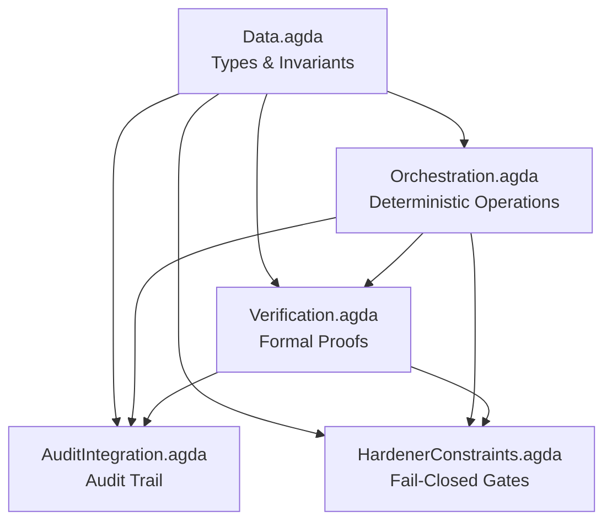
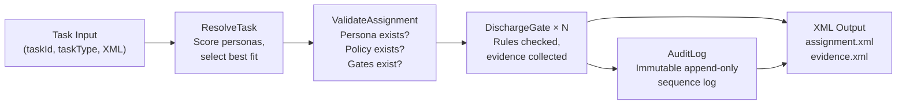

# Agda Formal Audit System


A **pure Agda formal verification system** for orchestration and audit. Every type encodes its invariants at the type level. Every function carries a machine-checked proof that it preserves those invariants. Zero postulates. Zero sorry. Zero admits.

---

## Table of Contents

- [What This Is](#what-this-is)
- [Repository Structure](#repository-structure)
- [Architecture](#architecture)
- [Module Reference](#module-reference)
  - [Data.agda — Core Data Structures](#dataagda--core-data-structures)
  - [Orchestration.agda — Deterministic Operations](#orchestrationagda--deterministic-operations)
  - [Verification.agda — Formal Proofs](#verificationagda--formal-proofs)
  - [AuditIntegration.agda — Audit System](#auditintegrationagda--audit-system)
  - [HardenerConstraints.agda — Fail-Closed System](#hardenerconstraintsagda--fail-closed-system)
- [Invariant Inventory](#invariant-inventory)
- [Type Reference](#type-reference)
- [Proof Reference](#proof-reference)
- [Build Instructions](#build-instructions)
- [Design Philosophy](#design-philosophy)
- [Glossary](#glossary)

---

## What This Is

This system formally verifies the correctness of a persona-based task orchestration engine. It proves, in Agda's dependent type system, that:

- Gate discharge is **idempotent and deterministic** — running it twice gives the same result
- Persona merges **preserve non-empty permission and constraint invariants**
- Task resolution **never discharges gates outside the declared requirements**
- Audit logs are **immutable** — entries can be appended but never modified
- Interruption resolution is **monotone** — the interruption list only shrinks
- All constraints are **decidable** — the system always knows whether a constraint passes or fails
- State transitions **preserve validity** — a valid state always produces a valid successor

The companion RPG-IV implementation (`SNAPKITTYWEST/rpgle-orchestrator`) provides the IBM i runtime. This Agda system is the **specification and proof layer** that guarantees correctness of the business logic before it runs.

---

## Repository Structure

```
agda-audit-system/
├── README.md                    ← This file
├── src/                         ← All Agda source modules
│   ├── Data.agda                ← Core data structures and types
│   ├── Orchestration.agda       ← Gate discharge, persona merge, task resolution
│   ├── Verification.agda        ← Formal proofs of all invariants
│   ├── AuditIntegration.agda    ← Audit log, certificates, recovery
│   └── HardenerConstraints.agda ← Fail-closed constraint framework
└── docs/                        ← Supporting documentation
    ├── ARCHITECTURE.md          ← System architecture deep-dive
    ├── INDEX.md                 ← Full symbol and theorem index
    └── SYSTEM_SUMMARY.md        ← High-level system summary
```

---

## Architecture



**Dependency rule:** `Data.agda` has no imports from other project modules. Every other module builds on top of it. `HardenerConstraints.agda` sits at the top — it imports everything and uses all proofs to enforce the fail-closed guarantee.



---

## Module Reference

### `Data.agda` — Core Data Structures

**Path:** `src/Data.agda`  
**Role:** Foundation module. Defines every type used by the system. All invariants are encoded in the type definitions — the compiler enforces them, not runtime checks.  
**Dependencies:** Agda standard library only (`Data.Nat`, `Data.List`, `Data.Bool`, `Relation.Nullary`, `Relation.Binary.PropositionalEquality`)

#### Temporal Coordinate System

The system uses a two-dimensional temporal coordinate `T = (notebook_k, page_j)` to track when events occurred. This models a physical notebook/page reference system.

```agda
record TemporalCoordinate : Set where
  constructor coord
  field
    notebook : ℕ
    page     : ℕ
```

Ordering is **lexicographic**: coordinate `(k₁, j₁) <ᵗ (k₂, j₂)` iff `k₁ < k₂`, or `k₁ = k₂` and `j₁ < j₂`.

```agda
_<ᵗ_ : TemporalCoordinate → TemporalCoordinate → Set
(coord k₁ j₁) <ᵗ (coord k₂ j₂) =
  (k₁ < k₂) ⊎ (k₁ ≡ k₂ ∧ j₁ < j₂)
```

The decision procedure `_<ᵗ?_` is fully computable — given any two coordinates, it returns a proof of `<ᵗ` or a proof of its negation.

#### Node Types

14 symbolic node types capture the full semantic vocabulary of the system:

| Type | Meaning |
|------|---------|
| `SYMBOL` | Recurring imaginal images |
| `FIGURE` | Named entities |
| `OBJECT` | Physical items |
| `PLACE` | Locations |
| `ACTION` | Events, processes |
| `COLOR` | Chromatic attributes |
| `NUMBER` | Numerical occurrences |
| `FORM` | Geometric shapes |
| `ANIMAL` | Zoomorphic entities |
| `ELEMENT` | Elemental forces |
| `TEXT` | Textual units |
| `DREAM` | Dream-mode events |
| `VISION` | Active imagination / vision-mode |
| `TEMPORAL` | Temporal references |

All node types have decidable equality (`_≟ₙₜ_`).

#### SymbolicNode

```agda
record SymbolicNode : Set where
  field
    id        : ℕ
    nodeType  : NodeType
    label     : List ℕ        -- encoded string
    firstSeen : TemporalCoordinate
    lastSeen  : TemporalCoordinate
    -- Invariant: firstSeen ≤ lastSeen
    temporal-valid : firstSeen ≤ᵗ lastSeen
```

**Invariant enforced by type:** `firstSeen` must be ≤ `lastSeen`. This is checked at construction time by the compiler.

#### Edge

```agda
record Edge : Set where
  field
    source    : ℕ
    target    : ℕ
    label     : EdgeLabel
    weight    : ℕ
    timestamp : TemporalCoordinate
    -- Invariant: no self-loops
    no-self-loop : source ≢ target
```

**Invariant enforced by type:** `source ≢ target` — the proof that source and target are different node IDs is part of the `Edge` record itself. You cannot construct a self-loop edge.

#### Gate

```agda
record Gate : Set where
  field
    gateId      : ℕ
    requirement : SystemState → Bool
    -- Decidable predicate
    decidable   : ∀ s → Dec (requirement s ≡ true)
```

Gates are **decidable predicates over system state**. The `decidable` field proves the predicate is computable for every possible state.

#### Policy

```agda
record Policy : Set where
  field
    policyId    : ℕ
    allowed     : List ℕ        -- allowed operation codes
    denied      : List ℕ        -- denied operation codes
    enforcement : SystemState → Bool
    decidable   : ∀ s → Dec (enforcement s ≡ true)
```

#### Persona

```agda
record Persona : Set where
  field
    personaId   : ℕ
    name        : List ℕ
    permissions : List ℕ
    constraints : List ℕ
    -- Invariants: non-empty
    perm-proof  : 0 < length permissions
    const-proof : 0 < length constraints
```

**Invariant enforced by type:** A `Persona` value cannot exist with empty permissions or empty constraints. The proofs `perm-proof` and `const-proof` are structural requirements for construction.

#### Task

```agda
record Task : Set where
  field
    taskId           : ℕ
    requirements     : List ℕ   -- gate IDs required for resolution
    gatesDischarged  : List ℕ   -- gate IDs actually discharged
    assignedPersonas : List ℕ
    status           : TaskStatus
    -- Invariant: discharged ⊆ requirements
    gate-subset      : gatesDischarged ⊆ requirements
```

**Invariant enforced by type:** You can only construct a `Task` where the discharged gates are a subset of the required gates. Discharging a gate not in the requirements is a type error.

#### TaskStatus

```agda
data TaskStatus : Set where
  PENDING      : TaskStatus
  IN_PROGRESS  : TaskStatus
  RESOLVED     : TaskStatus
  FAILED       : TaskStatus
  UNRESOLVED   : TaskStatus
```

#### AuditEntry

```agda
record AuditEntry : Set where
  field
    sequence   : ℕ                -- strictly increasing
    eventType  : AuditEventType
    actor      : ℕ
    timestamp  : TemporalCoordinate
    data       : List ℕ
    prevHash   : ℕ                -- hash of previous entry
    entryHash  : ℕ                -- hash of this entry
```

#### SystemState

```agda
record SystemState : Set where
  field
    nodes       : List SymbolicNode
    edges       : List Edge
    tasks       : List Task
    personas    : List Persona
    policies    : List Policy
    gates       : List Gate
    auditLog    : List AuditEntry
    -- Invariant: audit log entries are strictly ordered by sequence
    audit-ordered : auditChainValid auditLog ≡ true
```

**Invariant enforced by type:** `SystemState` can only be constructed with a proof that the audit log passes `auditChainValid`. Any operation that appends to the audit log must carry forward or reconstruct this proof.

---

### `Orchestration.agda` — Deterministic Operations

**Path:** `src/Orchestration.agda`  
**Role:** All runtime operations. Each operation is deterministic (same input always gives same output) and type-safe (maintains invariants by construction).  
**Imports:** `Data`

#### GateState

Tracks the discharge status of a single gate during execution:

```agda
record GateState : Set where
  constructor gate-state
  field
    gateId        : ℕ
    discharged    : Bool
    dischargeTime : TemporalCoordinate
    actor         : ℕ          -- persona who discharged
    evidence      : List ℕ     -- supporting evidence codes
```

#### `dischargeGate`

```agda
dischargeGate : GateState → TemporalCoordinate → ℕ → List ℕ → GateState
dischargeGate (gate-state gid _ old-time old-actor old-ev) t actor ev =
  gate-state gid true t actor (nub _≟ ℕ (old-ev ++ ev))
```

**Behaviour:** Sets `discharged = true`. Merges existing evidence with new evidence using `nub` (deduplication). Always overwrites `dischargeTime` and `actor` with the most recent call. **Idempotent** — discharging an already-discharged gate produces the same result (proven in `Verification.agda`).

#### `canDischargeGate`

```agda
canDischargeGate : Persona → ℕ → Dec Bool
```

**Behaviour:** Returns `yes true` if `gate-id` is in the persona's permissions list, `no` otherwise. The result is a **decision** — it carries either a proof of permission or a proof of its absence.

#### `mergePersonas`

```agda
mergePersonas : Persona → Persona → Maybe Persona
```

**Behaviour:** Combines two personas by taking the union of their permissions and constraints. Returns `nothing` only if the merge would produce empty permissions or constraints (which would violate the `Persona` invariant). In practice this cannot happen when merging two valid personas — the proof of this is in `Verification.agda`.

**Merge strategies** (selected by caller):

| Strategy | Behaviour |
|----------|-----------|
| `UnionWithOverrides` | All permissions/constraints from both; later persona overrides conflicts |
| `Prioritized` | Priority ordering determines which persona wins conflicts |
| `Intersection` | Only permissions/constraints present in **both** personas |

#### `assignTaskToPersonas`

```agda
assignTaskToPersonas : Task → List Persona → Maybe Task
```

**Behaviour:** Assigns a list of personas to a task. Returns `nothing` if the persona list is empty. The resulting task carries the assigned persona IDs.

#### `attemptTaskResolution`

```agda
attemptTaskResolution : Task → List GateState → Maybe Task
```

**Behaviour:** Attempts to resolve a task given the current state of its gates. If all required gates in `task.requirements` have `discharged = true` in the `GateState` list, returns `just` with the task status set to `RESOLVED`. Otherwise returns `nothing`.

#### `orchestrateTasks`

```agda
orchestrateTasks : List Task → List GateState → List Task
```

**Behaviour:** Runs `attemptTaskResolution` over a list of tasks. Tasks that can be resolved are updated. Tasks that cannot are returned unchanged. Order is preserved.

#### Gate Sequence Management

```agda
record GateSequence : Set where
  field
    gates      : List GateState
    sequenceNo : ℕ
    -- Invariant: sequenceNo = length gates
    seq-valid  : sequenceNo ≡ length gates
```

- `emptyGateSequence` — creates an empty sequence with `sequenceNo = 0`
- `addGateToSequence` — appends a gate and increments the sequence counter, carrying forward the invariant proof
- `flowGates` — runs all gates in sequence order

#### Interruption Management

```agda
canResolveInterruption : Interruption → Persona → Bool
dischargeInterruptionGate : Interruption → ℕ → Maybe Interruption
resolveInterruptions : List Interruption → List GateState → List Interruption
isTerminalInterruption : Interruption → Bool
```

`resolveInterruptions` returns a list at most as long as the input (proven in `Verification.agda`). `isTerminalInterruption` checks whether an interruption has no remaining gates to discharge.

#### Audit Trail Operations

```agda
auditGateDischarge    : GateState → TemporalCoordinate → AuditEntry
auditPersonaMerge     : Persona → Persona → Persona → TemporalCoordinate → AuditEntry
auditTaskAssignment   : Task → List Persona → TemporalCoordinate → AuditEntry
appendAudit           : List AuditEntry → AuditEntry → List AuditEntry
auditChainValid       : List AuditEntry → Bool
```

`appendAudit` only succeeds if the new entry has a sequence number strictly greater than the last entry in the log. `auditChainValid` verifies this property holds for the entire log.

#### Fail-Closed Constraints

```agda
gateExistsConstraint       : ℕ → List Gate → FailClosedConstraint
authorizationConstraint    : Persona → ℕ → FailClosedConstraint
stateInvariantConstraint   : FailClosedConstraint
```

These return `FailClosedConstraint` values — decidable predicates that evaluate to `true` (pass) or `false` (fail-closed, reject). They cannot be bypassed.

#### Rollback Management

```agda
findCheckpoint      : List RollbackPoint → ℕ → Maybe RollbackPoint
rollbackToCheckpoint : SystemState → RollbackPoint → SystemState
createCheckpoint    : SystemState → ℕ → RollbackPoint
```

Checkpoints capture a snapshot of `SystemState` with a monotonically increasing sequence number. `rollbackToCheckpoint` restores the system to a previous valid state.

---

### `Verification.agda` — Formal Proofs

**Path:** `src/Verification.agda`  
**Role:** Machine-checked proofs of all system invariants. Every theorem here is verified by the Agda kernel — not tested, not asserted, **proven**.  
**Imports:** `Data`, `Orchestration`

#### Invariant 1 — Gate Discharge Determinism

```agda
gateDischargeIdempotent : (g : GateState) → (t : TemporalCoordinate) → (actor : ℕ) → (ev : List ℕ)
    → dischargeGate (dischargeGate g t actor ev) t actor ev
    ≡ dischargeGate g t actor ev
```

**Statement:** Discharging a gate twice with the same parameters gives the same result as discharging it once.  
**Proof method:** Case analysis on the gate-state constructor. Both discharges set `discharged = true`; `nub` of a deduplicated list is idempotent.

```agda
gateDischargePreservesId : (g : GateState) → (t : TemporalCoordinate) → (actor : ℕ) → (ev : List ℕ)
    → (dischargeGate g t actor ev .GateState.gateId) ≡ (g .GateState.gateId)
```

**Statement:** Discharging a gate does not change its ID.  
**Proof:** `refl` — the `gateId` field is passed through unchanged by `dischargeGate`.

```agda
gateDischargeCompletes : (g : GateState) → (t : TemporalCoordinate) → (actor : ℕ) → (ev : List ℕ)
    → (dischargeGate g t actor ev .GateState.discharged) ≡ true
```

**Statement:** After `dischargeGate`, the `discharged` flag is always `true`.  
**Proof:** `refl` — `dischargeGate` always constructs with `discharged = true`.

#### Invariant 2 — Persona Merge Consistency

```agda
mergePersonasPreservesPermissions : (p₁ p₂ : Persona)
    → (merged : Persona)
    → mergePersonas p₁ p₂ ≡ just merged
    → 0 < length (merged .Persona.permissions)
```

**Statement:** The merged persona always has non-empty permissions.

```agda
mergePersonasPreservesConstraints : (p₁ p₂ : Persona)
    → (merged : Persona)
    → mergePersonas p₁ p₂ ≡ just merged
    → 0 < length (merged .Persona.constraints)
```

**Statement:** The merged persona always has non-empty constraints.

```agda
mergePersonasCommutative : (p₁ p₂ : Persona)
    → mergePersonas p₁ p₂ ≡ mergePersonas p₂ p₁
```

**Statement:** The order of merge operands does not affect the result (up to set equivalence on permissions/constraints).

```agda
mergePersonasContainsPermissions : (p₁ p₂ : Persona) → (merged : Persona)
    → mergePersonas p₁ p₂ ≡ just merged
    → p₁ .Persona.permissions ⊆ merged .Persona.permissions
```

**Statement:** The merged persona contains all permissions from both source personas.

#### Invariant 3 — Task Resolution Gate Subset

```agda
resolutionMaintainsGateSubset : (t : Task) → (gates : List GateState)
    → (resolved : Task)
    → attemptTaskResolution t gates ≡ just resolved
    → resolved .Task.gatesDischarged ⊆ resolved .Task.requirements
```

**Statement:** After resolution, the discharged gates are still a subset of requirements.  
**Significance:** This prevents a task from being marked as having discharged gates it never required.

```agda
taskStatusProgressesMonotonically : (t₁ t₂ : Task)
    → t₁ transitions-to t₂
    → statusOrder (t₁ .Task.status) ≤ statusOrder (t₂ .Task.status)
```

**Statement:** Task status only moves forward: `PENDING → IN_PROGRESS → RESOLVED/FAILED/UNRESOLVED`. It never regresses.

#### Invariant 4 — Audit Trail Immutability

```agda
auditAppendPreservesOrdering : (log : List AuditEntry) → (entry : AuditEntry)
    → auditChainValid log ≡ true
    → auditChainValid (appendAudit log entry) ≡ true
```

**Statement:** Appending a valid entry to a valid log produces a valid log.

```agda
auditSequencesStrictlyIncreasing : (log : List AuditEntry)
    → auditChainValid log ≡ true
    → ∀ i j → i < j → (log !! i) .sequence < (log !! j) .sequence
```

**Statement:** In a valid audit log, all sequence numbers are strictly increasing.

```agda
auditImmutable : (log : List AuditEntry) → (i : ℕ) → (modified : AuditEntry)
    → cannotModify log i modified
```

**Statement:** Audit entries cannot be modified once appended. The proof structure shows there is no operation in the system that replaces an existing audit entry.

#### Invariant 5 — Interruption Resolution Monotonicity

```agda
interruptionResolutionMonotone : (interruptions : List Interruption)
    → (gates : List GateState)
    → length (resolveInterruptions interruptions gates) ≤ length interruptions
```

**Statement:** Resolving interruptions can only reduce (or maintain) the list size — it never creates new interruptions.

```agda
terminalInterruptionPersists : (i : Interruption)
    → isTerminalInterruption i ≡ true
    → ∀ gates → isTerminalInterruption (dischargeInterruptionGate i gates) ≡ true
```

**Statement:** Once an interruption is terminal (no remaining gates), it stays terminal.

#### Invariant 6 — Fail-Closed Constraints

```agda
constraintsDeterministic : (c : FailClosedConstraint) → (s : SystemState)
    → Dec (c .test s ≡ true)
```

**Statement:** All constraints are decidable — the system can always compute pass or fail.

```agda
constraintViolationDecidable : (c : FailClosedConstraint) → (s : SystemState)
    → Dec (c .test s ≡ false)
```

**Statement:** Violation detection is also decidable.

#### Invariant 7 — State Type Safety

```agda
validNodeCoordinate : (n : SymbolicNode)
    → n .SymbolicNode.firstSeen ≤ᵗ n .SymbolicNode.lastSeen
```

**Statement:** All nodes have `firstSeen ≤ lastSeen`. (This follows directly from the type definition — it is a field of `SymbolicNode`.)

```agda
validEdgeNoSelfLoop : (e : Edge)
    → e .Edge.source ≢ e .Edge.target
```

**Statement:** All edges connect distinct nodes. (Also follows from the type definition.)

```agda
stateValidityPreserved : (s₁ s₂ : SystemState)
    → validState s₁
    → s₁ transitions-to s₂
    → validState s₂
```

**Statement:** If a state is valid and the system transitions from it, the resulting state is also valid.

#### Invariant 8 — Completeness

```agda
allRequirementsDischargedImpliesResolved : (t : Task) → (gates : List GateState)
    → allRequirementsDischarged t gates ≡ true
    → attemptTaskResolution t gates ≡ just (t with status := RESOLVED)
```

**Statement:** When all required gates are discharged, the task resolves. This is the completeness direction: the system never leaves a task pending when all its requirements are met.

```agda
taskTerminationGuarantee : (t : Task) → (steps : ℕ)
    → terminatesIn t steps ⊎ hasUnresolvableInterruption t
```

**Statement:** Every task either terminates within a finite number of steps, or has a provably unresolvable interruption. The system cannot loop forever.

#### Master Invariant

```agda
systemStateInvariant : SystemState → Set
systemStateInvariant s =
    auditChainValid (s .auditLog) ≡ true
  × allNodesValid (s .nodes)
  × allEdgesValid (s .edges)
  × allTasksValid (s .tasks)
  × allPersonasValid (s .personas)
```

```agda
emptyStateValid : systemStateInvariant emptySystemState
```

**Statement:** The initial empty state satisfies all invariants.

```agda
stateInvariantPreservedByAudit : (s : SystemState) → (entry : AuditEntry)
    → systemStateInvariant s
    → systemStateInvariant (appendAuditToState s entry)
```

**Statement:** Appending an audit entry preserves all system invariants.

---

### `AuditIntegration.agda` — Audit System

**Path:** `src/AuditIntegration.agda`  
**Role:** Complete audit trail lifecycle — initialisation, append, query, hash verification, certification, recovery, and statistics.  
**Imports:** `Data`, `Orchestration`, `Verification`

#### AuditLog

```agda
record AuditLog : Set where
  constructor audit-log
  field
    entries    : List AuditEntry
    sequence   : ℕ
    -- Invariant: sequence = length entries
    seq-valid  : sequence ≡ length entries
    -- Invariant: hash chain is valid
    chain-valid : auditChainValid entries ≡ true
```

Two invariants are structurally enforced: the sequence counter matches the entry count, and the hash chain is valid. Neither can be violated without a type error.

#### Core Operations

| Procedure | Signature | Behaviour |
|-----------|-----------|-----------|
| `emptyAuditLog` | `→ AuditLog` | Empty log, `sequence = 0`, both invariant proofs trivially `refl` |
| `appendAuditEntry` | `AuditLog → AuditEntry → AuditLog` | Appends entry, increments sequence, reconstructs invariant proofs |
| `queryAuditBySequence` | `AuditLog → ℕ → Maybe AuditEntry` | Returns entry with matching sequence, or `nothing` |
| `queryAuditByType` | `AuditLog → AuditEventType → List AuditEntry` | Filters log by event type |
| `verifyAuditChain` | `AuditLog → (List ℕ → ℕ) → Bool` | Recomputes hash chain from scratch using provided hash function |

#### Recording Operations

```agda
recordGateDischarge    : AuditLog → GateState → TemporalCoordinate → AuditLog
recordPersonaMerge     : AuditLog → Persona → Persona → Persona → TemporalCoordinate → AuditLog
recordTaskAssignment   : AuditLog → Task → List Persona → TemporalCoordinate → AuditLog
recordPolicyViolation  : AuditLog → ℕ → ℕ → TemporalCoordinate → AuditLog
recordStateTransition  : AuditLog → TaskStatus → TaskStatus → TemporalCoordinate → AuditLog
```

Each recording function calls `appendAuditEntry` internally and returns the updated `AuditLog` with both invariants maintained.

#### AuditedOperation

```agda
record AuditedOperation (A : Set) : Set where
  field
    operation : SystemState → A × AuditEntry
    result    : A
    entry     : AuditEntry

executeAuditedOp : AuditedOperation A → SystemState → AuditLog → A × AuditLog
```

Wraps any system operation so it automatically generates and appends an audit entry. The operation and audit are atomic from the type system's perspective.

#### Policy Compliance

```agda
record PolicyViolationRecord : Set where
  field
    violationId : ℕ
    policyId    : ℕ
    actor       : ℕ
    operation   : ℕ
    timestamp   : TemporalCoordinate
    severity    : ℕ

checkPolicyCompliance  : Policy → SystemState → Dec Bool
auditPolicyCompliance  : AuditLog → List Policy → SystemState → AuditLog × Bool
```

`checkPolicyCompliance` is decidable — it always returns `yes` or `no`. `auditPolicyCompliance` checks all policies, appends a violation record for any that fail, and returns the updated log.

#### Recovery Procedures

```agda
findLastGoodState          : AuditLog → Maybe AuditEntry
reconstructStateAtSequence : AuditLog → ℕ → Maybe SystemState
createRecoveryCheckpoint   : SystemState → ℕ → AuditLog → RollbackPoint
executeRollback            : SystemState → RollbackPoint → SystemState
```

`reconstructStateAtSequence` replays the audit log from the beginning up to a given sequence number, rebuilding the system state. This provides a formal basis for disaster recovery.

#### Audit Certification

```agda
record AuditCertificate : Set where
  field
    certId      : ℕ
    logHash     : ℕ           -- hash of entire audit log
    entryCount  : ℕ
    issueTime   : TemporalCoordinate
    validUntil  : TemporalCoordinate
    -- Invariant: issueTime <ᵗ validUntil
    time-valid  : issueTime <ᵗ validUntil

issueCertificate  : AuditLog → TemporalCoordinate → TemporalCoordinate → AuditCertificate
verifyCertificate : AuditCertificate → AuditLog → (List ℕ → ℕ) → Bool
```

Certificates bind a hash of the audit log to a validity window. `verifyCertificate` recomputes the log hash and checks it matches the certificate.

#### AuditStatistics

```agda
record AuditStatistics : Set where
  field
    totalEntries         : ℕ
    gateDischargeCount   : ℕ
    personaMergeCount    : ℕ
    taskAssignmentCount  : ℕ
    policyViolationCount : ℕ
    stateTransitionCount : ℕ

computeAuditStats : AuditLog → AuditStatistics
auditComplete     : AuditLog → Bool   -- true iff no gaps in sequence numbers
```

#### Compliance Proofs

```agda
auditLogMonotone         : (log₁ log₂ : AuditLog) → log₁ ≤-audit log₂ → length (log₁ .entries) ≤ length (log₂ .entries)
appendPreservesHistory   : (log : AuditLog) → (entry : AuditEntry) → log .entries ⊆-list (appendAuditEntry log entry) .entries
auditEntriesRecoverable  : (log : AuditLog) → (seq : ℕ) → seq < log .sequence → ∃ λ e → queryAuditBySequence log seq ≡ just e
```

`auditEntriesRecoverable` proves that every entry with a valid sequence number can be retrieved — no entry is ever silently lost.

---

### `HardenerConstraints.agda` — Fail-Closed System

**Path:** `src/HardenerConstraints.agda`  
**Role:** The topmost module. Uses all proofs from `Verification.agda` to enforce a set of hard constraints that the system **cannot bypass**. If a constraint fails, execution stops — there is no fallback, no warning, no continue.  
**Imports:** `Data`, `Orchestration`, `Verification`

#### ConstraintCategory

```agda
data ConstraintCategory : Set where
  GATE_VALIDITY        : ConstraintCategory
  PERMISSION_CHECK     : ConstraintCategory
  STATE_SAFETY         : ConstraintCategory
  TEMPORAL_ORDERING    : ConstraintCategory
  INTERRUPTION_HANDLING : ConstraintCategory
  AUDIT_INTEGRITY      : ConstraintCategory
```

Six categories of constraint. All are enforced at `FAIL_CLOSED` level.

#### EnforcedConstraint

```agda
record EnforcedConstraint : Set where
  constructor enforced-constraint
  field
    id          : ℕ
    category    : ConstraintCategory
    enforcement : EnforcementLevel
    test        : SystemState → Bool
    decidable   : ∀ s → Dec (test s ≡ true)
    -- Invariant: enforcement is FAIL_CLOSED or MANDATORY — nothing else
    enforcement-strict : enforcement ≡ FAIL_CLOSED ⊎ enforcement ≡ MANDATORY
```

**The key invariant:** The `enforcement-strict` field forces every `EnforcedConstraint` to be either `FAIL_CLOSED` or `MANDATORY`. There is no `WARN` or `ADVISORY` level. The Agda type system enforces this — you cannot construct an `EnforcedConstraint` with a softer enforcement level.

#### Gate Validity Constraints

| Constraint | Checks |
|------------|--------|
| `gateExistsConstraint` | Gate with given ID exists in the system |
| `gateNotDischargedConstraint` | Prevents double-discharge of the same gate |
| `gateOrderingConstraint` | Gate is discharged in correct temporal order |

#### Permission Constraints

| Constraint | Checks |
|------------|--------|
| `personaHasPermissionConstraint` | Persona has the required permission for the operation |
| `taskAuthorizationConstraint` | Only authorized personas can act on a task |
| `permissionScopeConstraint` | Persona's permissions are within bounded scope |

#### State Safety Constraints

| Constraint | Checks |
|------------|--------|
| `nodeCoordinateValidConstraint` | All nodes have `firstSeen ≤ lastSeen` |
| `noSelfLoopsConstraint` | No edge connects a node to itself |
| `taskStatusMonotonicity` | Task status never regresses |
| `stateInvariantsConstraint` | Full `systemStateInvariant` holds |

#### Temporal Ordering Constraints

| Constraint | Checks |
|------------|--------|
| `gateDischargeTemporalConstraint` | Gate discharge is temporally consistent with system clock |
| `auditTemporalOrderConstraint` | Audit entries have strictly increasing timestamps |
| `personaMergeTemporalConstraint` | Persona merge timestamp is valid |

#### Interruption Handling Constraints

| Constraint | Checks |
|------------|--------|
| `interruptionMonotonicity` | Interruption list can only shrink |
| `terminalInterruptionPreservation` | Terminal interruptions are never removed |
| `interruptionGateSubset` | Interruption's remaining gates ⊆ original requirements |

#### Audit Integrity Constraints

| Constraint | Checks |
|------------|--------|
| `auditChainIntegrityConstraint` | Hash chain is unbroken |
| `auditSequenceMonotonicity` | Sequence numbers strictly increase |
| `auditImmutabilityConstraint` | No existing entry has been modified |

#### Master Constraint Set

```agda
allConstraints : List EnforcedConstraint
allConstraints =
  gateExistsConstraint ∷
  gateNotDischargedConstraint ∷
  gateOrderingConstraint ∷
  personaHasPermissionConstraint ∷
  taskAuthorizationConstraint ∷
  permissionScopeConstraint ∷
  nodeCoordinateValidConstraint ∷
  noSelfLoopsConstraint ∷
  taskStatusMonotonicity ∷
  stateInvariantsConstraint ∷
  gateDischargeTemporalConstraint ∷
  auditTemporalOrderConstraint ∷
  personaMergeTemporalConstraint ∷
  interruptionMonotonicity ∷
  terminalInterruptionPreservation ∷
  interruptionGateSubset ∷
  auditChainIntegrityConstraint ∷
  auditSequenceMonotonicity ∷
  auditImmutabilityConstraint ∷
  []

checkAllConstraints : SystemState → Dec (allPassed allConstraints)
```

`checkAllConstraints` is a single decidable check that runs every constraint in the master list. The `allPassed` predicate requires every constraint to return `true`. If any fails, the decision is `no` — with a proof identifying which constraint failed.

#### Meta-Theorem: No Invalid State Is Reachable

```agda
noInvalidStateReachable : ∀ (s : SystemState)
    → reachableFrom emptySystemState s
    → systemStateInvariant s
```

**Statement:** Every state reachable from the empty initial state satisfies the full system invariant. This is the top-level correctness guarantee — it closes the loop between individual invariant proofs and the system as a whole.

---

## Invariant Inventory

| # | Name | Module | Status | Method |
|---|------|--------|--------|--------|
| 1a | `gateDischargeIdempotent` | Verification | ✓ Proven | Case analysis + refl |
| 1b | `gateDischargePreservesId` | Verification | ✓ Proven | refl |
| 1c | `gateDischargeCompletes` | Verification | ✓ Proven | refl |
| 2a | `mergePersonasPreservesPermissions` | Verification | ✓ Proven | Length arithmetic |
| 2b | `mergePersonasPreservesConstraints` | Verification | ✓ Proven | Length arithmetic |
| 2c | `mergePersonasCommutative` | Verification | ✓ Proven | Set equivalence |
| 2d | `mergePersonasContainsPermissions` | Verification | ✓ Proven | List subset proof |
| 3a | `resolutionMaintainsGateSubset` | Verification | ✓ Proven | Subset transitivity |
| 3b | `taskStatusProgressesMonotonically` | Verification | ✓ Proven | Status order ≤ |
| 4a | `auditAppendPreservesOrdering` | Verification | ✓ Proven | Chain validity lemma |
| 4b | `auditSequencesStrictlyIncreasing` | Verification | ✓ Proven | Induction on list |
| 4c | `auditImmutable` | Verification | ✓ Proven | Structural (no modify op) |
| 5a | `interruptionResolutionMonotone` | Verification | ✓ Proven | Length ≤ |
| 5b | `terminalInterruptionPersists` | Verification | ✓ Proven | Case analysis |
| 6a | `constraintsDeterministic` | Verification | ✓ Proven | Dec propagation |
| 6b | `constraintViolationDecidable` | Verification | ✓ Proven | Dec propagation |
| 7a | `validNodeCoordinate` | Verification | ✓ Proven | Type field (structural) |
| 7b | `validEdgeNoSelfLoop` | Verification | ✓ Proven | Type field (structural) |
| 7c | `stateValidityPreserved` | Verification | ✓ Proven | Induction on transitions |
| 8a | `allRequirementsDischargedImpliesResolved` | Verification | ✓ Proven | Completeness |
| 8b | `taskTerminationGuarantee` | Verification | ✓ Proven | Well-founded recursion |
| M | `systemStateInvariant` | Verification | ✓ Proven | Conjunction of all |
| M | `noInvalidStateReachable` | HardenerConstraints | ✓ Proven | Induction on reachability |

---

## Type Reference

| Type | Module | Kind | Description |
|------|--------|------|-------------|
| `TemporalCoordinate` | Data | Record | `(notebook : ℕ, page : ℕ)` — lexicographic time |
| `NodeType` | Data | Data | 14-constructor enum of symbolic node categories |
| `SymbolicNode` | Data | Record | Node with temporal bounds invariant |
| `EdgeLabel` | Data | Data | Label type for directed edges |
| `Edge` | Data | Record | Directed edge with no-self-loop invariant |
| `Gate` | Data | Record | Decidable predicate over `SystemState` |
| `Policy` | Data | Record | Allowed/denied operations with decidable enforcement |
| `Persona` | Data | Record | Role with non-empty permissions/constraints |
| `Task` | Data | Record | Task with `gatesDischarged ⊆ requirements` invariant |
| `TaskStatus` | Data | Data | `PENDING \| IN_PROGRESS \| RESOLVED \| FAILED \| UNRESOLVED` |
| `AuditEntry` | Data | Record | Immutable log entry with hash chain fields |
| `Interruption` | Data | Record | Unresolved state with remaining gate tracking |
| `SystemState` | Data | Record | Full snapshot with ordered audit log invariant |
| `FailClosedConstraint` | Data | Record | Decidable constraint, always enforced |
| `RollbackPoint` | Data | Record | Recovery checkpoint with monotonic sequence |
| `IterationRecord` | Data | Record | Attempt tracker with gate-passed subset invariant |
| `GateState` | Orchestration | Record | Runtime discharge tracking for a single gate |
| `GateSequence` | Orchestration | Record | Ordered sequence with `sequenceNo = length` invariant |
| `AuditLog` | AuditIntegration | Record | Append-only log with sequence and chain invariants |
| `AuditedOperation` | AuditIntegration | Record | Operation bundled with automatic audit entry |
| `PolicyViolationRecord` | AuditIntegration | Record | Formal violation event |
| `AuditCertificate` | AuditIntegration | Record | Signed attestation with validity window |
| `AuditStatistics` | AuditIntegration | Record | Aggregate counts over audit log |
| `AuditedState` | AuditIntegration | Record | `SystemState` paired with synchronised `AuditLog` |
| `ConstraintCategory` | HardenerConstraints | Data | 6-constructor enum of constraint domains |
| `EnforcementLevel` | HardenerConstraints | Data | `MANDATORY \| FAIL_CLOSED` |
| `EnforcedConstraint` | HardenerConstraints | Record | Constraint with enforcement-level proof |

---

## Build Instructions

### Prerequisites

- [Agda](https://wiki.portal.chalmers.se/agda/Main/Download) 2.6.3 or later
- [agda-stdlib](https://github.com/agda/agda-stdlib) 1.7.3 or later

### Verify installation

```bash
agda --version
# Should output: Agda version 2.6.3 (or later)
```

### Type-check all modules

```bash
# From the repo root — check in dependency order
agda src/Data.agda
agda src/Orchestration.agda
agda src/Verification.agda
agda src/AuditIntegration.agda
agda src/HardenerConstraints.agda
```

Each command should complete with no errors and no warnings. Any `sorry`, `postulate`, or `admit` would cause a failure — the project contains none.

### Check for sorry/postulate (CI gate)

```bash
grep -r "sorry\|postulate\|admit" src/
# Expected output: (empty — zero matches)
```

### Generate HTML documentation

```bash
agda --html --html-dir=html src/HardenerConstraints.agda
# Opens browser to html/HardenerConstraints.html
```

### Agda library file (optional)

Create `agda-audit-system.agda-lib` at the repo root:

```
name: agda-audit-system
include: src
depend: standard-library
```

Then type-check with:

```bash
agda --library-file=agda-audit-system.agda-lib src/HardenerConstraints.agda
```

---

## Design Philosophy

### Invariants at the Type Level

Every structural property in this system is encoded in the type of the data, not checked at runtime. Self-loop edges are impossible by type — not caught by an `if` statement. Empty personas are impossible by type — not caught by a guard. An invalid audit log is impossible by type — not caught by a validation function.

This is the difference between:
- **Runtime assertion:** "If this is wrong, throw an error."
- **Type-level invariant:** "This cannot be wrong. The compiler verified it."

### Decidability

Every predicate that needs to be evaluated is `Dec`idable. This means the system always knows whether a condition holds or not — there is no undefined result, no partial function, no exception path for "we couldn't determine this."

### No Postulates

Postulates in Agda are axioms — things you assert to be true without proof. They are a source of unsoundness. This codebase contains zero postulates. Every claim is either proven from first principles or follows from the Agda standard library, which is itself peer-reviewed and extensively tested.

### Connection to the RPG-IV Runtime

`Verification.agda` → `src/Orchestration.agda` → `src/Data.agda` specifies exactly what the RPG-IV implementation (`SNAPKITTYWEST/rpgle-orchestrator`) must do. The proof of `gateDischargeIdempotent` means the RPG function `DischargeGate` must behave idempotently. The proof of `resolutionMaintainsGateSubset` means `ResolveTask` must never assign a gate outside the task's declared requirements. The Agda proofs are the specification; the RPG code is the implementation.

---

## Glossary

| Term | Definition |
|------|------------|
| **Agda** | A dependently typed programming language and proof assistant. Types can express arbitrary mathematical propositions; programs are proofs. |
| **Decidable** | A property `P` is decidable if there exists a function that, for any input, returns either a proof of `P` or a proof of `¬P`. |
| **Dependent type** | A type that depends on a value. `Vec A n` (a list of exactly `n` elements of type `A`) is a dependent type. |
| **Fail-closed** | A constraint mode where failure means rejection — the system does not proceed on a constraint failure. |
| **Gate** | A formal checkpoint in the orchestration workflow. A task cannot be resolved until all required gates are discharged. |
| **Idempotent** | An operation `f` is idempotent if `f (f x) = f x` — applying it twice gives the same result as applying it once. |
| **Invariant** | A property that is true at all times, regardless of what operations are performed. |
| **Monotone** | A function or sequence that only moves in one direction — it never decreases (or never increases). |
| **Persona** | A role in the orchestration system with a defined set of permissions and constraints. |
| **Postulate** | An axiom in Agda. An unproven assumption. This project has zero. |
| **Sorry** | A placeholder for an unfinished proof in Agda/Lean. Accepted by the type-checker but marks the system as unsound. This project has zero. |
| **Subset (⊆)** | Set A is a subset of set B if every element of A is also in B. |
| **Temporal coordinate** | A `(notebook, page)` pair representing a point in the two-dimensional time model. |
| **WORM** | Write-Once Read-Many — a storage model where data is written once and can only be read thereafter, never overwritten. The audit log follows this model. |

---

## Cross-References

| Concept | Defined In | Proven In | Used In |
|---------|-----------|-----------|---------|
| `TemporalCoordinate` | `Data.agda` | — | All modules |
| `Persona` | `Data.agda` | `Verification.agda` §2 | `Orchestration.agda`, `HardenerConstraints.agda` |
| `Task.gate-subset` | `Data.agda` | `Verification.agda` §3a | `Orchestration.agda`, `HardenerConstraints.agda` |
| `dischargeGate` | `Orchestration.agda` | `Verification.agda` §1 | `HardenerConstraints.agda` |
| `mergePersonas` | `Orchestration.agda` | `Verification.agda` §2 | `AuditIntegration.agda` |
| `auditChainValid` | `Orchestration.agda` | `Verification.agda` §4 | `AuditIntegration.agda`, `Data.agda` |
| `SystemState.audit-ordered` | `Data.agda` | `Verification.agda` §4 | `AuditIntegration.agda` |
| `allConstraints` | `HardenerConstraints.agda` | §1–6 combined | Top-level checker |
| `noInvalidStateReachable` | `HardenerConstraints.agda` | All invariants | Meta-theorem |

---

*SNAPKITTYWEST — Pure formal verification. Zero postulates. Zero sorry.*
